# 大作业：基于深度学习的脑部肿瘤 MRI 目标检测

## 1. 项目背景与数据集说明

脑肿瘤的精确定位对于手术规划和放射治疗至关重要。与分类任务不同，目标检测要求模型在图像中划定边界框（Bounding Box）并识别病灶。本项目旨在利用主流检测算法，实现对脑部 MRI 影像中病灶的自动化定位。

- 目标：在脑部 MRI 序列中，自动检测并框选出肿瘤区域。
- 数据位于数据集文件夹中的训练、测试和验证三个文件夹中存放，对应的标注文件位于相应文件夹的annotations.json文件夹中。
- 标注信息包含对应样本图片ROI区域的多个点的坐标，因此需要通过预处理计算出包含每个肿瘤的边界框坐标 xmin, ymin, xmax, ymax。

## 2. 项目方案

- 尺寸归一化：将所有图片统一缩放至固定尺寸，同步缩放标注坐标以确保位置精准。
- 像素值归一化：进行 Z-score 标准化或最大最小值归一化，增强病灶边缘特征。
- 标签转换：将原始标注转换为模型所需的格式（如 YOLO 的 .txt 或 COCO 的 .json）
- 模型搭建：选择合适的检测模型，推荐使用 YOLO 系列（如 YOLOv8/v10） 或 Faster R-CNN，设置合适的超参数，搭建完整的端到端模型，可以尝试配置 Neck 层(如 FPN/PAN)以增强对微小肿瘤的检测性能。
- 模型优化：选择合适的损失函数(结合分类损失与回归损失（如 CIoU/GIoU Loss)和优化方法，尝试使用在模型优化部分提到的优化方法（非极大值抑制 (NMS)、数据增强(Mosaic, Mixup)等）来尽可能提升模型效果。
- 模型评估：完成模型的训练过程，使用验证集完成超参数调整(可选)，**计算模型在测试集上的计算 mAP (Mean Average Precision)、召回率 和 精确度，评估预测框与真实框的 IoU (Intersection over Union)，画出mAP 曲线、Loss 曲线、混淆矩阵以及测试集的检测可视化结果图（显示预测框与真实框）。**
- 模型持久化：最后保存模型与参数。

## 项目报告

实验报告应包含以下核心板块：

- 代码实现：展示数据预处理、标签转换、模型定义及训练过程。
- 结果截图：展示 mAP 曲线、Loss 曲线、混淆矩阵以及测试集的 检测可视化结果图（显示预测框与真实框）。
- 结果分析：
  - 讨论模型对不同尺寸病灶的检测准确度。
  - 分析 NMS 阈值调节对最终检测结果的影响。
  - 总结通过参数调整获得的性能增益。

___
___

**【结果截图】**

### ①：数据集预览: 随机数据展示，含标签标注信息

> 数据展示1
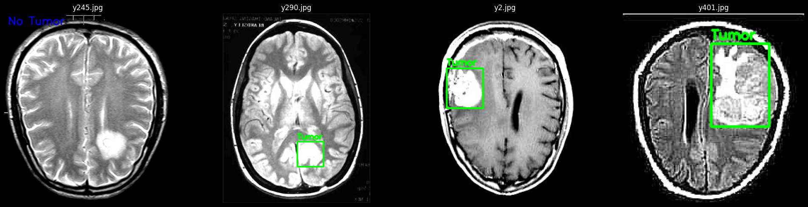

> 数据展示2
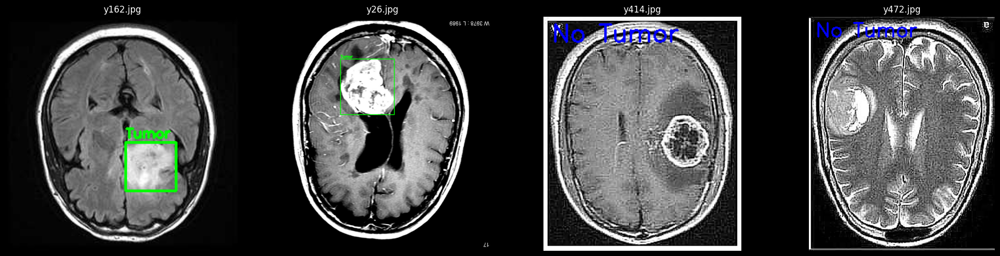

### ②：r94-p67 型 - 即 [recall94%-pre67%]

先说结论：

```bash
Loading model from: ./runs/r94-p67/weights/best.pt 
[省略部分梗概 ······]
=== 测试集评估 ===
Ultralytics YOLOv8.2.63 🚀 Python-3.10.0 torch-2.5.0+cu124 CUDA:0 (NVIDIA GeForce RTX 4060 Laptop GPU, 8188MiB)

YOLOv8m summary (fused): 218 layers, 25,840,339 parameters, 0 gradients, 78.7 GFLOPs
val: Scanning /home/shao/CNNProject/Medical-DeepLearn/Torch/bigwork/3/dataset/test/labels.cache... 100 images, 43 backgrounds, 0 corrupt: 100%|██████████| 100/100 [00:00<?, ?it/s]
                 Class     Images  Instances      Box(P          R      mAP50  mAP50-95): 100%|██████████| 7/7 [00:00<00:00,  7.89it/s]
                   all        100         57        0.7      0.777      0.764      0.563
Speed: 0.3ms preprocess, 5.2ms inference, 0.0ms loss, 0.8ms postprocess per image
```

> mAP 曲线
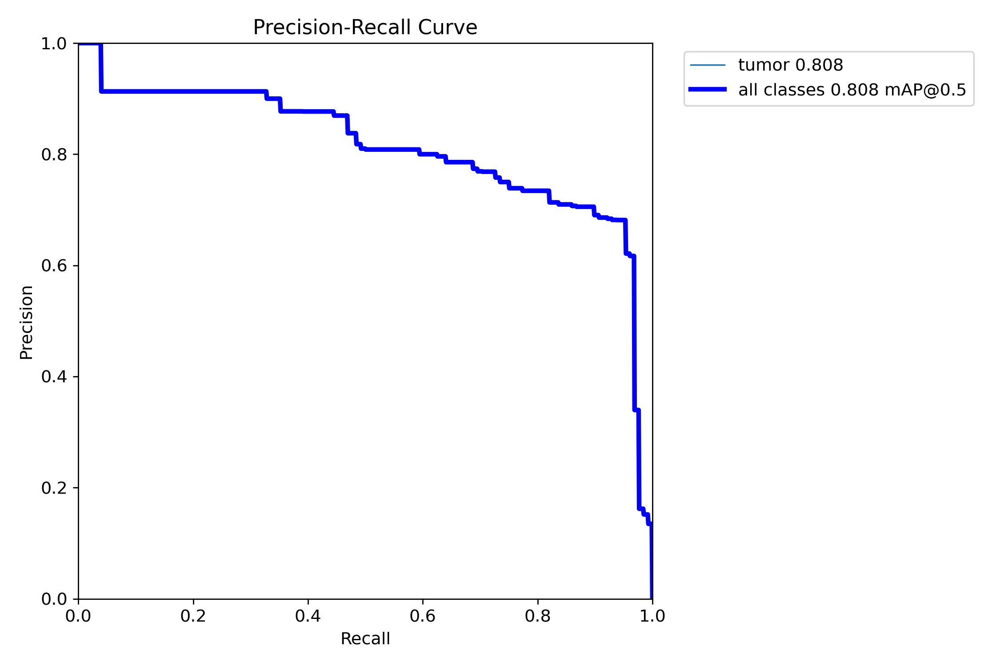

> loss 曲线
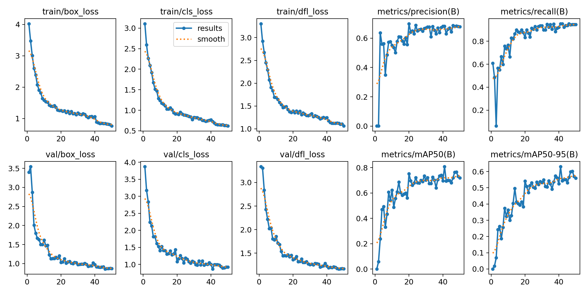

> 混淆矩阵


> val 随带检测结果（可选）
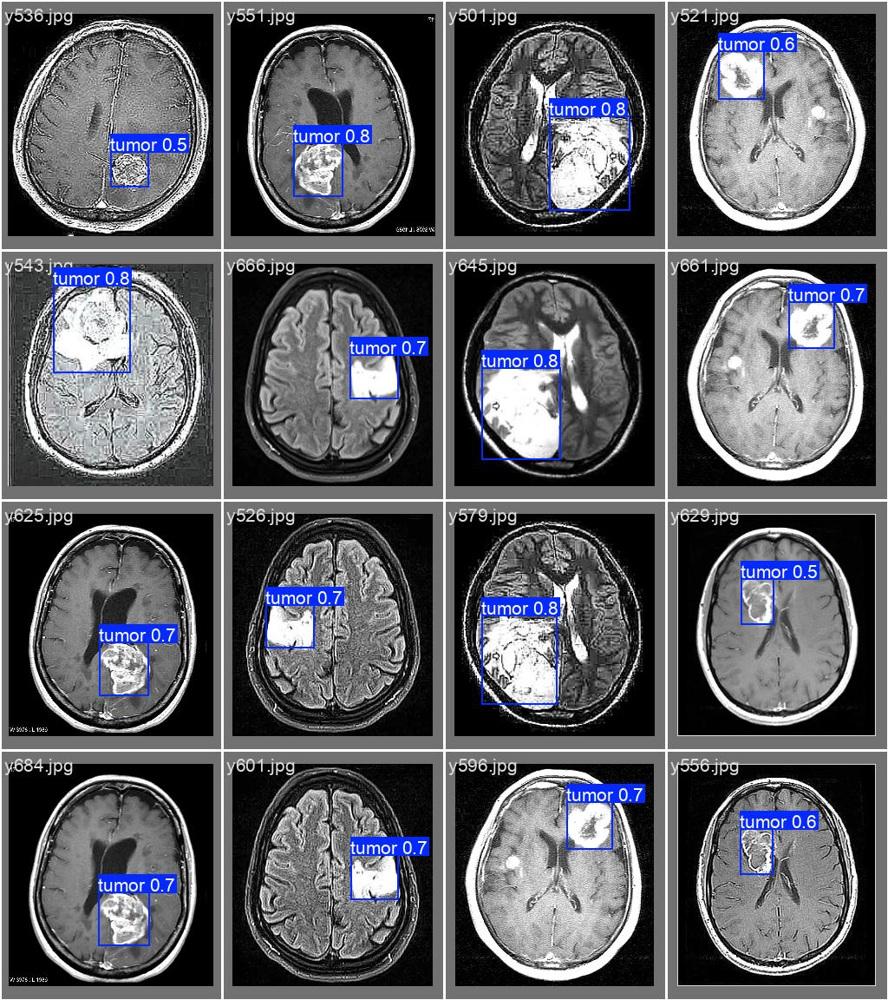

> test 检测结果
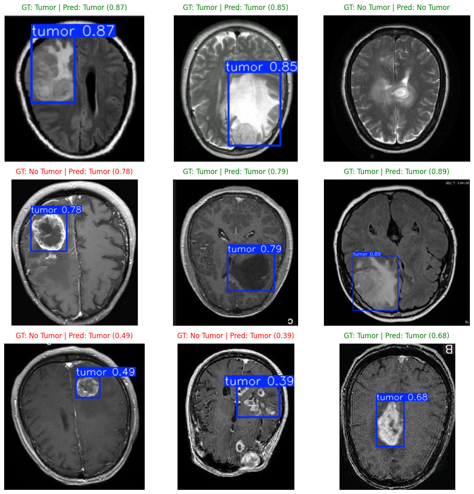

> 交叉相关图
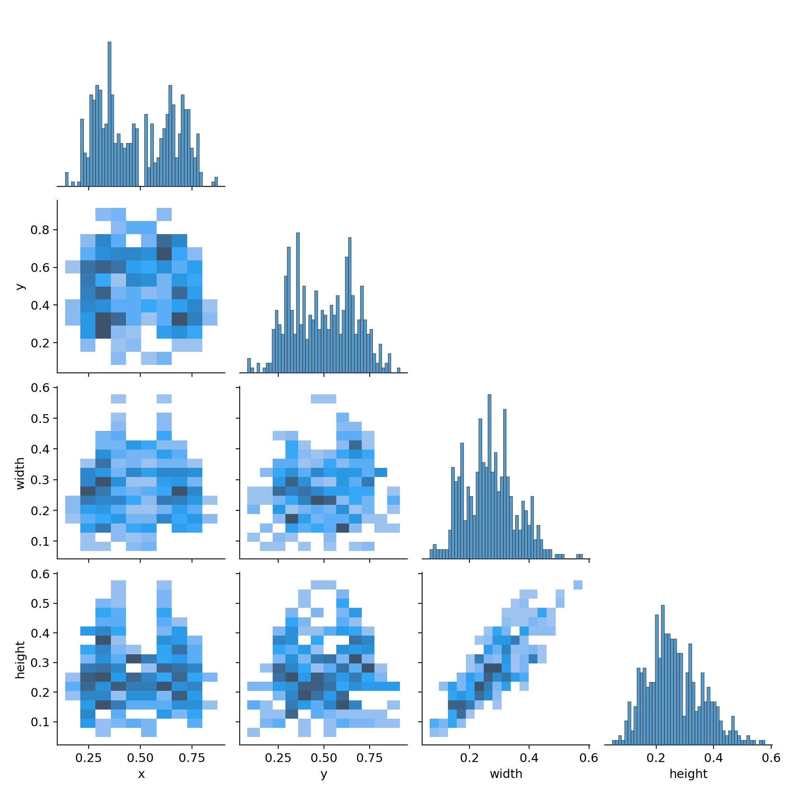

___
___

### ②：r93-p63 型 - 即 [recall93%-pre63%]

先说结论：

```bash
Loading model from: ./runs/r93-p63/weights/best.pt
[省略部分梗概 ······]
=== 测试集评估 ===
Ultralytics YOLOv8.2.63 🚀 Python-3.10.0 torch-2.5.0+cu124 CUDA:0 (NVIDIA GeForce RTX 4060 Laptop GPU, 8188MiB)
YOLOv8x summary (fused): 268 layers, 68,124,531 parameters, 0 gradients, 257.4 GFLOPs
val: Scanning /home/shao/CNNProject/Medical-DeepLearn/Torch/bigwork/3/dataset/test/labels.cache... 100 images, 43 backgrounds, 0 corrupt: 100%|██████████| 100/100 [00:00<?, ?it/s]
                 Class     Images  Instances      Box(P          R      mAP50  mAP50-95): 100%|██████████| 7/7 [00:01<00:00,  4.79it/s]
                   all        100         57      0.528      0.895      0.677      0.516
Speed: 0.4ms preprocess, 7.8ms inference, 0.0ms loss, 2.5ms postprocess per image
```

> mAP 曲线
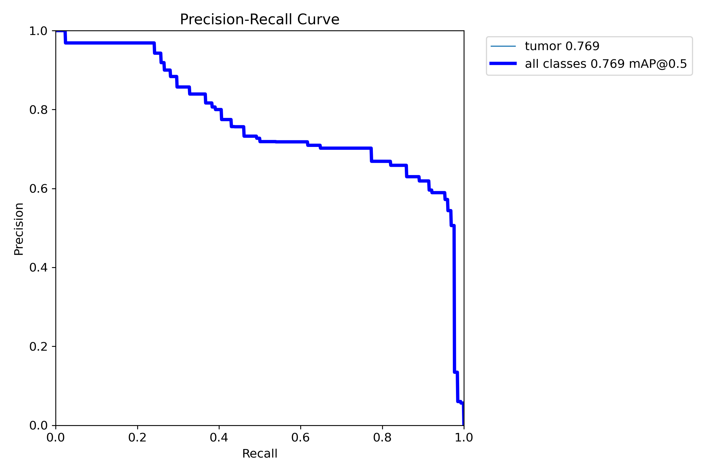

> loss 曲线
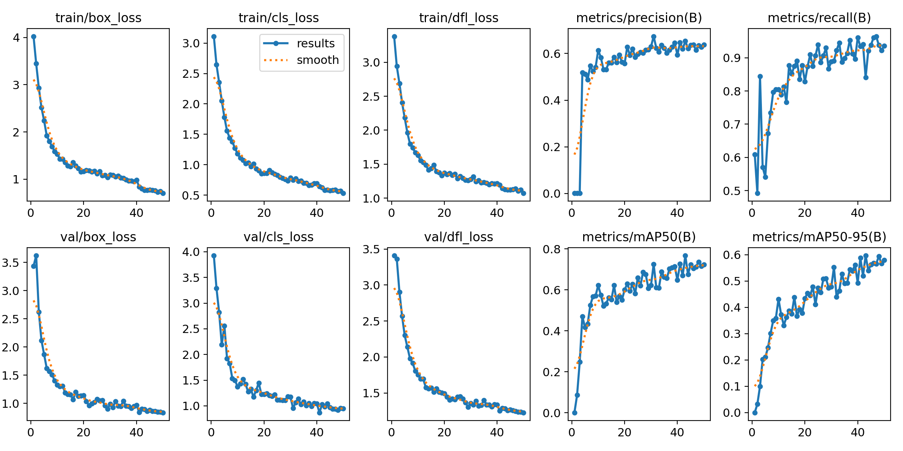

> 混淆矩阵
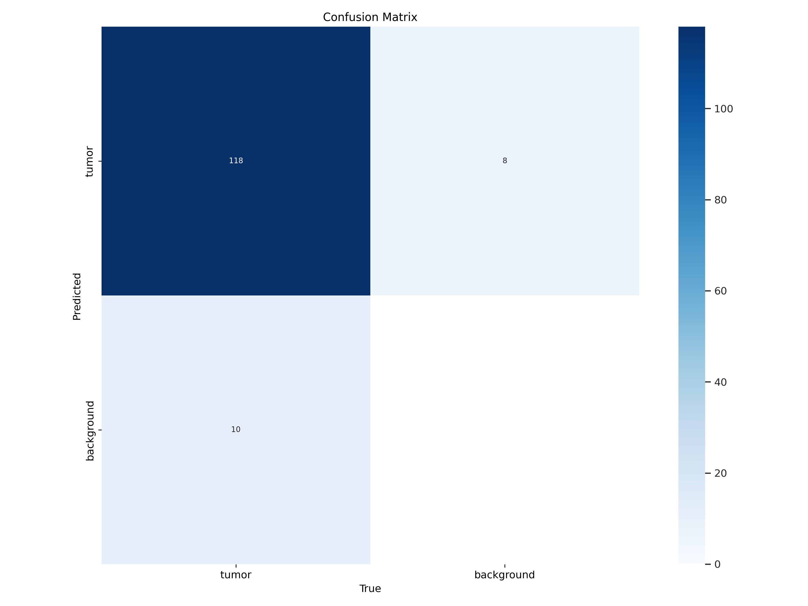

> val 随带检测结果（可选）
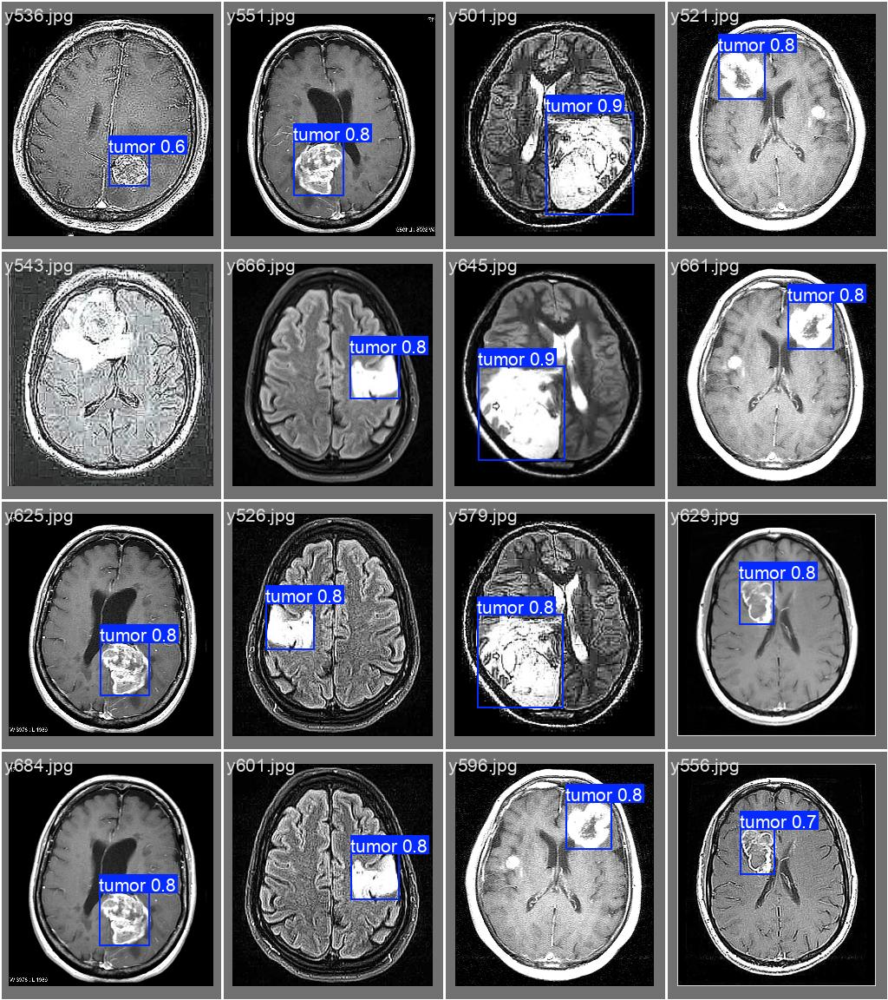

> test 检测结果
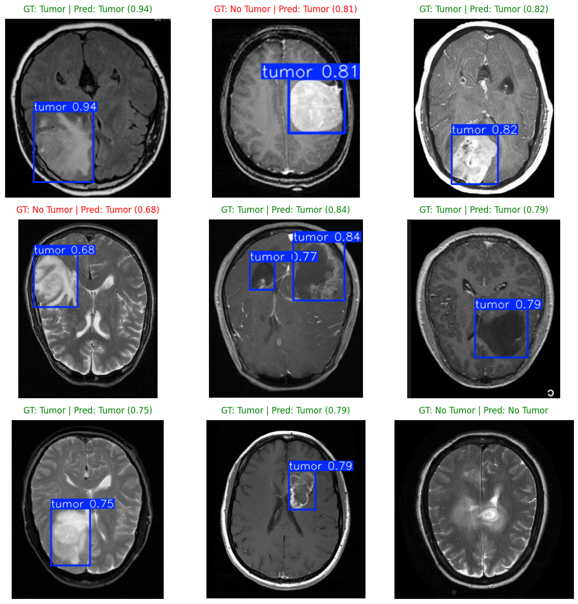

> 交叉相关图


___
___

# 本项目介绍

## 一、 数据集预处理流程

### 1.1 标注格式转换 (Polygon/Ellipse to BBox)

原始数据集提供的标注格式为 VGG Polygon（多边形顶点坐标）和 Ellipse（椭圆中心、长短轴、角度）。为了适配 YOLOv8 模型，进行了以下转换：
- **Polygon**: 提取所有顶点 `(x, y)`，计算最小包围矩形框 `(xmin, ymin, xmax, ymax)`。
- **Ellipse**: 根据中心 `(cx, cy)` 和半径 `rx, ry`，计算近似边界框。
- **格式统一**: 将绝对坐标转换为 YOLO 标准格式：`class_id x_center y_center width height`，其中所有坐标均相对于图像宽高进行归一化处理（0-1 之间）。

### 1.2 数据集划分与负样本处理

* **类别设置**: 本项目为单类别检测任务，标签为 `0: tumor`。
- **负样本 (No Tumor)**: 原始数据集中存在部分图像标注为空（无肿瘤区域）。预处理时，这些图像对应的 `.txt` 标签文件保持空白。YOLOv8 能够自动识别空白标签文件作为背景（Background/Negative）样本参与训练，有效降低模型的误报率（False Positives）。
- **目录结构**: 按照 YOLOv8 规范重构目录，分离为 `dataset/train`, `dataset/val`, `dataset/test`，分别包含 `images/` 和 `labels/` 文件夹。

## 二、 模型选择与架构设计

### 2.1 模型选型

选用 **YOLOv8 (Medium/Large)** 作为基准模型。
- **选择依据**: 相比于 Nano 版本，Medium/Large 版本拥有更多的参数量和更深的网络层数，具备更强的特征提取能力，能够更好地捕捉 MRI 影像中微小或边缘模糊的肿瘤特征。

### 2.2 核心架构

* **Backbone (骨干网络)**: 采用 CSPDarknet53 变体，通过 C2f 模块增强特征流动，提取多尺度特征。
- **Neck (颈部网络)**: 使用 PAN-FPN (Path Aggregation Network + Feature Pyramid Network) 结构。这对于医学图像至关重要，因为它融合了深层语义特征（用于分类）和浅层空间特征（用于精确定位微小肿瘤）。
- **Head (检测头)**: Decoupled Head（解耦头），将分类任务（Classification）与边界框回归任务（Regression）分离，提高了检测精度。

## 三、 训练参数配置

| 参数名称           | 设定值                      | 说明                                               |
| :----------------- | :-------------------------- | :------------------------------------------------- |
| **Model**          | `yolov8m.pt` / `yolov8x.pt` | 使用官方预训练权重进行迁移学习                     |
| **Optimizer**      | `Adamax`                    | 相比 SGD/Adam，Adamax 在特定 Loss 曲面下收敛更平稳 |
| **Epochs**         | `50`                        | 训练 50 轮，兼顾收敛效果与时间成本                 |
| **Batch Size**     | `16`                        | 针对 RTX 4060 (8GB) 显存优化的批次大小             |
| **Image Size**     | `256`                       | 输入分辨率配置                                     |
| **Learning Rate**  | `0.0005`                    | 初始学习率，配合 Warmup 防止梯度爆炸               |
| **AMP (混合精度)** | `False`                     | 关闭以避免底层环境报错，虽降速但保稳定             |
| **Workers**        | `0`                         | 单进程数据加载，防止 Jupyter 环境死锁              |

## 四、 优化策略与调参分析

### 4.1 损失函数

采用 **CIoU Loss + DFL (Distribution Focal Loss)**。
- CIoU 考虑了重叠面积、中心点距离和长宽比，使预测框能更紧密地贴合肿瘤边缘。
- DFL 用于优化边界框回归的分布质量，提升定位精度。

### 4.2 数据增强策略

* **Mosaic**: 在训练前 40 轮开启，后 10 轮（`close_mosaic=10`）自动关闭，有助于模型在训练末期专注于细节微调，避免拼接伪影干扰收敛。
- **Mixup**: 开启随机图像混合，增强模型对复杂背景的鲁棒性。

### 4.3 性能调优

* **学习率预热 (Warmup)**: 设置 3 轮 Warmup，学习率从 0 缓慢升至设定值，保护预训练权重不被破坏。
- **NMS (非极大值抑制)**: 默认 IoU 阈值 0.7。在推理阶段，若同一位置出现多个重叠框，NMS 会保留置信度最高的一个，抑制冗余预测。

___
___

姓名：清蒸大老爷

学号：114514（误
